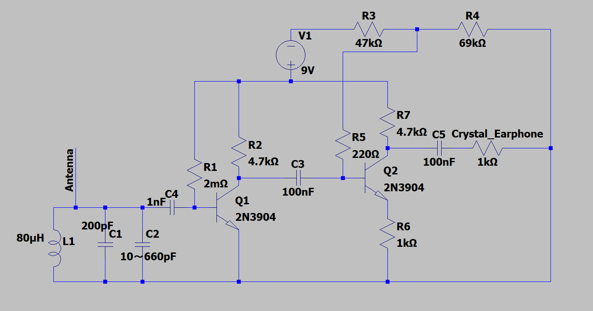

# AM_radio_circuit_project
自作AMラジオの開発・改良

# 自作ラジオ回路の設計・製作

## 概要
趣味として、AMラジオ回路を一から設計・製作したプロジェクトです。  
回路図作成、部品選定、基板実装、ノイズ改善まで行いました。

## 動機
大学で回路の実験や授業を受ける中で、回路を自分で作ってみたいというように思い、はんだ付けが必要なラジオ回路を作ることで回路の細かい特徴を理解できると思ったから

## 目的
- 電波の仕組みを理解し、動作するラジオを作ること
- 実際に使用可能なラジオを作ること
- キットではなく自分で一から設計・実装・改善の一連の開発プロセスを経験すること

## 使用器具
- 抵抗
 - R1: 2MΩ
 - R2: 4.7kΩ
 - R3: 47kΩ
 - R4: 69kΩ
 - R5: 220Ω
 - R6: 1kΩ
 - R7: 4.7kΩ
- コンデンサ
 - C1: 200pF
 - C2: 10~660pF
 - C3: 100nF
 - C4: 1nF
 - C5: 100nF
- コイル
 - L1: 約80µH（空芯コイル、自作）
- トランジスタ
 - Q1: 2N3904（増幅用）
 - Q2: 2N3904（増幅用）
- その他
 - アンテナ線
 - クリスタルイヤホン
 - グラウンド線

## 作業内容・工夫
- 回路設計を自分で作図（参考資料を参考にしつつ、自分で構成を決定）
- 部品選定およびコンデンサ・コイルの調整によるノイズ低減
- 基板に実装し、動作確認と改善を繰り返す
- 試行錯誤を通じて問題解決力を養う

## 改良過程
1. トランジスタを一つ使用し、コイルは市販のチョークコイルを使用、コンデンサ（同調用）は固定値のセラミックコンデンサを使用したため、コンデンサを付け替えながらちょうど合う周波数を探した。
2. バリコン（可変コンデンサ）を使用することで、周波数の調整が容易になりNHKの局の放送が小音量で聞こえた。（ただし、Q値が低くNHK第一放送とNHK第二放送が被ってしまう）
3. コイルを市販のチョークコイルから空芯コイルに変更することで、Q値が向上しNHK第一放送と第二放送を分離して聞くことができた。
4. 音量を上げるため、トランジスタをもう一つ追加した。だが、一段目と同じような回路で追加するとノイズがひどくとても聞くに堪えない状態だった。
5. ノイズを低減するため、回路の特徴を一段目から変更し、ベースと電源に直列に抵抗をつなぐのではなく、分圧抵抗から配線することで電圧を安定させる。またエミッタ抵抗を追加することでさらに安定化させる。これらをすることで、NHK放送に限るが普通に聞く程度の音量まで大きくでき、ノイズも少なくすることができた。

## 成果
- NHKの放送局に限るが、クリアに放送を十分な音量で受信できる回路を完成
- 「仮説→検証→改善」の開発プロセスを体験

## 今後への応用
- 試行錯誤や改善を繰り返す姿勢だったり、正解が分からない課題で成果が出なくても忍耐強く続ける力を他の分野でも生かしていきたい
- 現在はプログラミング学習も進めており、今後はソフト開発にも挑戦予定

## 写真

### 基板（真上）

### 基板（正面）

### 部品側

### 回路図

## ファイル構成
